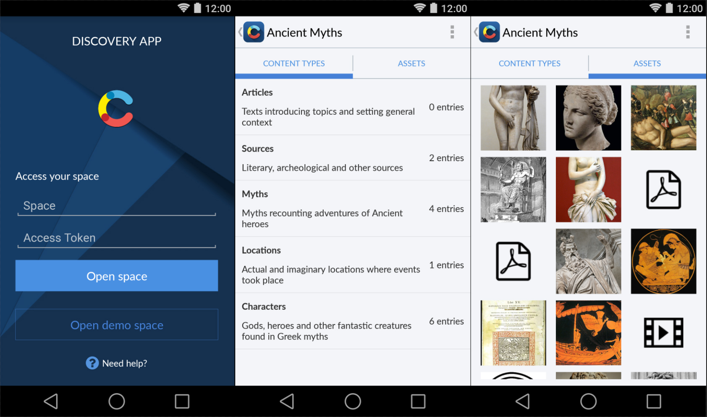

## Discovery app

This app enables you to browse and preview your [Contentful][1] Spaces on Android. It is compatible with API 14 or higher, and released as open source under the [MIT license][2].

Quick intro:

> Contentful is the flexible content management platform that makes it easy to serve content to mobile and web applications. Manage your content with your team once and simply publish it to any screen. Contentful gives your editors an easy-to-use editing interface to collaborate on content and developers a well-documented API to easily set up your delivery channels. With this app, you can preview the content from your Contentful workspaces by simply inserting the space ID and password. This will give you a sense of how your data will look on a mobile device without any further styling done to it. If you don’t have a Contentful account yet, you can browse through some more information in this app and sign up for free. We look forward to your feedback :) Happy publishing!

## Google Play

## Setup

Google Maps Android API V2 requires that you create an API key which corresponds with your keystore used to sign the APK once it is compiled. Please refer to the [official documentation][3] and follow a few easy steps to create an API key with your debug/release keystores, depending on your usage. When required to specify your SHA1 fingerprint along with the package name, you should provide the package name of this project: "**com.contentful.discovery**". Once you have created your API key, please update [config.xml][4] accordingly.

In the Android SDK Manager, ensure that the following are installed, and are updated to the latest available version:
- Tools > Android SDK Platform-tools (rev 21 or above)
- Tools > Android SDK Tools (rev 24 or above)
- Tools > Android SDK Build-tools version 21 (rev 21.1.1 or above)
- Android 5.0 > SDK Platform (API 21)
- Extras > Android Support Repository
- Extras > Android Support Library
- Extras > Google Play services
- Extras > Google Repository

Also, make sure to have JDK 7 installed on your machine, and configured in your IDE.

## Screenshots

## License

Copyright (c) 2015 Contentful GmbH. See [LICENSE.txt][2] for further details.

[1]: https://www.contentful.com
[2]: LICENSE.txt
[3]: https://developers.google.com/maps/documentation/android/start#get_an_android_certificate_and_the_google_maps_api_key
[4]: app/src/main/res/values/config.xml
